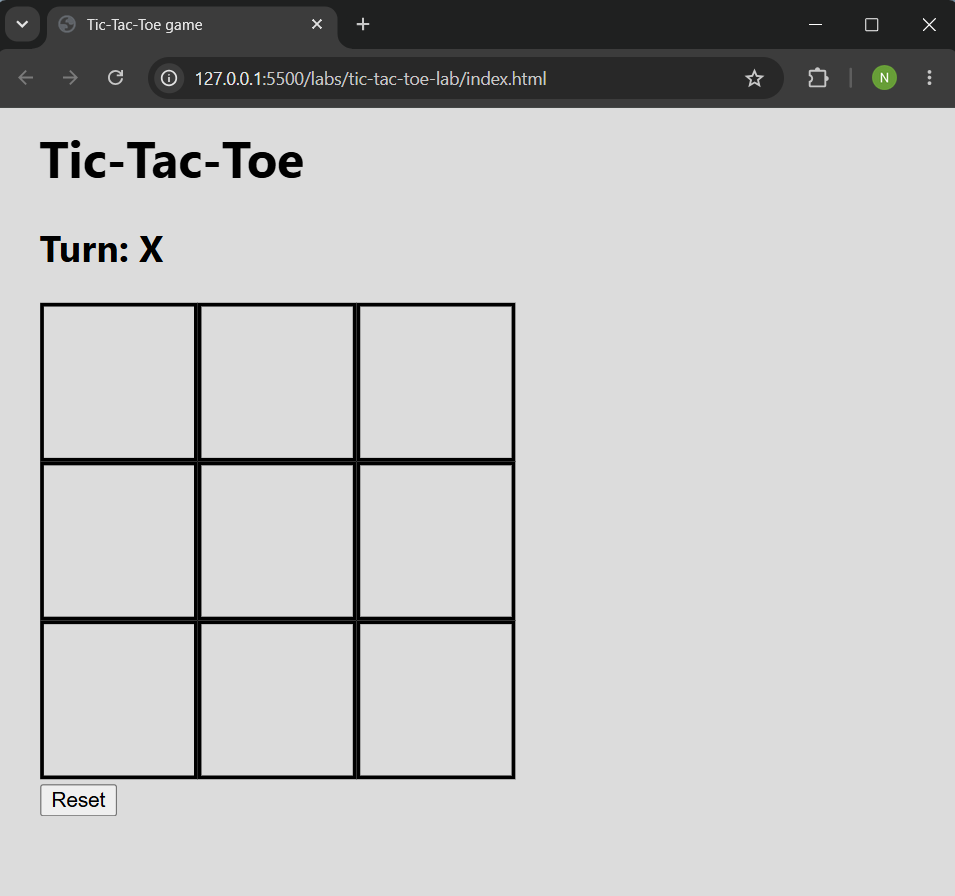
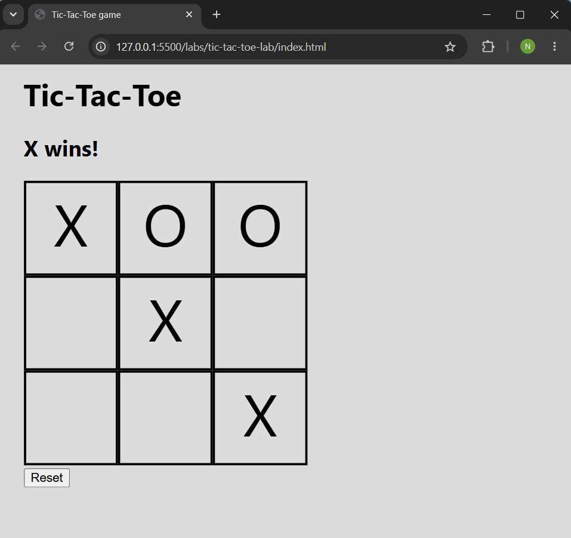
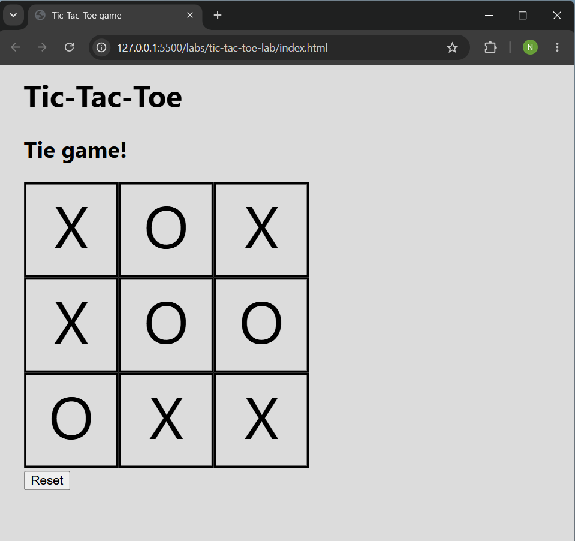
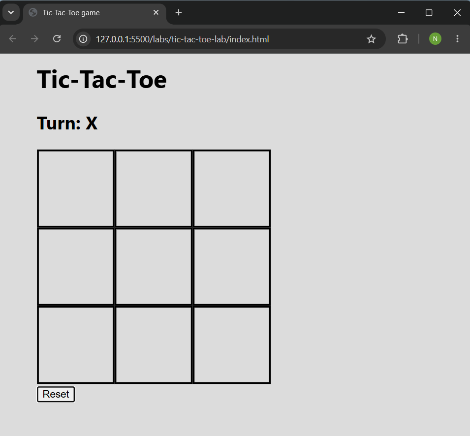

#  Tic-Tac-Toe Game

A simple and interactive Tic-Tac-Toe web game built using HTML, CSS, and JavaScript.

---

## Technologies Used

*  **HTML** — Structure of the game board and layout
*  **CSS** — Styling, layout design, and responsiveness
*  **JavaScript** — Game logic, interactivity, and state management

---

## Description

This project is a browser based implementation of the classic Tic-Tac-Toe game.
It allows two players to take turns placing their marks ( X and O ).

**The game automatically detects:**
* Winning conditions
* Draw (tie) situations
* Invalid moves

It also provides a reset option to start a new game anytime.

---

##  User Stories
* As a user, I want to see an empty tic-tac-toe board when the page loads so that I can start a new game.
* As a user, I want to click on a square to place my mark so that I can play the game.
* As a user, I want the game to alternate between X and O so that two players can take turns.
* As a user, I want to see whose turn it is so that I know when to play.
* As a user, I want to be prevented from clicking an already occupied square so that I follow the rules.
* As a user, I want the game to stop when someone wins so that no more moves can be made.
* As a user, I want to see a message when X or O wins so that I know the result.
* As a user, I want to see a message when the game ends in a tie so that I know no one won.
* As a user, I want a reset button so that I can start a new game anytime.
---

## Screenshots
### Game Start
The game starts with an empty board. Player X goes first.

---

### Winner Screen
This shows when X or O gets three in a row (horizontal, vertical, or diagonal).
The game ends and the winner is shown.

---
### Tie Screen

This screen appears when all cells are filled and no player has won. The game ends in a draw (no winner).

---
### Reset Game

The reset button clears the board and restarts the game from the beginning, allowing players to play again without refreshing the page.

---

##  Future Enhancements

* Add a score counter to track how many times each player (X and O) wins
* Single-player mode (Play vs Computer)
* Add animations and sound effects
* Improved mobile responsiveness

---

## Credits

* Built as part of a JavaScript learning labs
* Inspired by the classic Tic-Tac-Toe game

---
